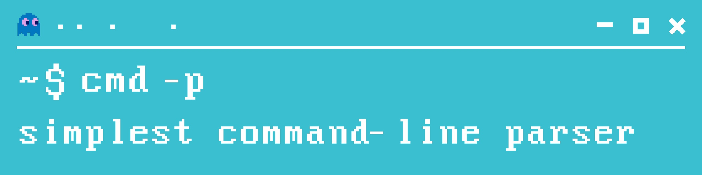

# scmdp - simplest command-line parser for C
A cross-platform command line parser library with a user-friendly interface

## Features
- [x] Output and error messages formatting easily accessible for changes
- [x] Non-optional, optional and valuable optional arguments 
- [x] Easily addition of new arguments to your program
- [x] Autoassembly help for all added arguments
- [x] Based on cross-platform C standard libraries
- [x] Automatic memory releasing

## Quick start
### 1. Add library to your own project
The [scmdp](https://github.com/drxvmrz/scmdp) library consists of only two files: [scmdp.h](https://github.com/drxvmrz/scmdp/tree/main/inc) as interface and [scmdp.с](https://github.com/drxvmrz/scmdp/tree/main/src) with implementation. There is nothing to pre-compile or pre-build, just add them to other source files of your project then compile it together. That's all, You are ready to create your own CLI user interface!

### 2. Start initialize arguments
....

## Examples
[Examples](https://github.com/drxvmrz/scmdp/tree/main/examples) folder contains two examples of using the [scmdp](https://github.com/drxvmrz/scmdp) library. Although they are rather primitive, they display all the necessary functionality and can serve as hint for a quick start.

### Abstract example

### Calculator

### Building examples
