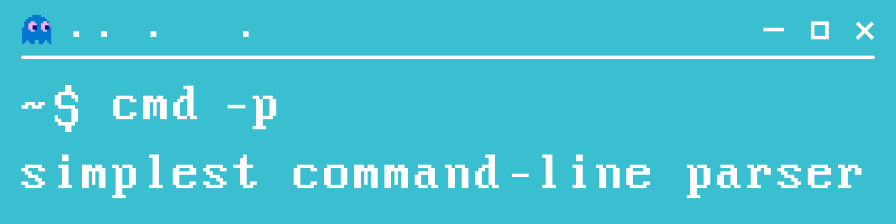

# scmdp - simplest command-line parser for C
A cross-platform command line parser library with a user-friendly interface

## Features
- [x] Output and error messages formatting easily accessible for changes
- [x] Non-optional, optional and valuable optional arguments 
- [x] Easily addition of new arguments to your program
- [x] Autoassembly help for all added arguments
- [x] Based on cross-platform C standard libraries
- [x] Automatic memory releasing

## Quick start
### 1. Add library to your own project
The [scmdp](https://github.com/drxvmrz/scmdp) library consists of only two files: [scmdp.h](https://github.com/drxvmrz/scmdp/tree/main/inc) as interface and [scmdp.с](https://github.com/drxvmrz/scmdp/tree/main/src) with implementation.  
There is nothing to pre-compile or pre-build, just add them to other project source files.

That's all, You are ready to create your own CLI user interface!
### 2. Create the workspace
The first thing to do is create a workspace. It stores all data about arguments of the program
```c++
ScmdpWorkspace AddWorkspace(char *syntaxHelp, char *description)
```
<details>
  <summary> Parameters and example </summary>
  
  ```syntaxHelp``` - String literal with syntax help. It issues if a number of entered parameters is too large or too small  
  ```description``` - String literal describing what the program will do and what its purpose is
  
  ```c++
  ScmdpWorkspace workspace = AddWorkspace("app [-opt] arg1 arg2", "Test command-line application!")
  ```
---
</details>

### 3. Start adding arguments
After creating the workspace, you can safely add new arguments to it.  
You can start by adding an argument calls help
```c++
void AddHelpArg(ScmdpWorkspace *workspace, char *longKey, char *shortKey)
```
<details>
  <summary> Parameters and example </summary>

  ```workspace``` - A pointer to created workspace  
  ```longKey``` - The long key to call a help argument (usually prefixed with '--' in UNIX)  
  ```shortKey``` - The short key to call a help argument (usually prefixed with '-' in UNIX)
  
  ```c++
  AddHelpArg(&workspace, "--help", "-h");
  ```
---
</details>

Also there's no obstacles to add a non-optional (necessary) agrument  
```c++
void AddNonOptArg(ScmdpWorkspace *workspace, char *key, char *help, char **valPlace)
```
<details>
  <summary> Parameters and example </summary>

  ```workspace``` - A pointer to created workspace  
  ```key``` - The name of non-optional argument  
  ```help``` - String literal describing what is the agrument purpose  
  ```valPlace``` - A pointer of variable to drop value of argument  
  
  ```c++
  char *arg1;

  AddNonOptArg(&workspace, "ARG1", "Necessary argument 1", **arg1);
  ```
---
</details>

You can add optional arguments if you need it.  
They can be either with or without a value, everything is done by one function
```c++
void AddOptArg(ScmdpWorkspace *workspace, char *longKey, char *shortKey, char *help, char *valName, char **valPlace);
```
<details>
  <summary> Parameters and example </summary>

  ```workspace``` - A pointer to created workspace  
  ```longKey``` - The long key to call a help argument (usually prefixed with '--' in UNIX)  
  ```shortKey``` - The short key to call a help argument (usually prefixed with '-' in UNIX)  
  ```help``` - String literal describing what is the agrument purpose  
  ```valName``` - String literal contains a name of value. Use "" if an argument is a non-valuable.  
  ```valPlace``` - A pointer of variable to drop value of argument  
  
  ```c++
  char *optArgWithValue;
  char *optArgWithoutValue;

  /* With value */
  AddOptArg(&workspace, "--option1", "-op1", "Optional argument 1 with value", "VALUE", &optArgWithValue);

  /* Without value. It drops a string literal "true" in *optArgWithoutValue if an argument is recieved */
  AddOptArg(&workspace, "--option2", "-op2", "Optional argument 2 without value", "", &optArgWithoutValue);
  ```
---
</details>

### 4. Parse you arguments
It is obvious that you were creating arguments to get their value. To do this, use the function
```c++
bool ParseArgs(&workspace, argc, argv);
```

<details>
  <summary> Parameters and example </summary>

  ```workspace``` - A pointer to created workspace  
  ```argc``` - The same is ```argc``` in ```int main(int argc, char* argv[])```  
  ```argv``` - The same is ```argv[]``` in ```int main(int argc, char* argv[])```   

  The function returns TRUE if parsing is a success.  
  Otherwise it returns FALSE.  
  
  ```c++
    /* If the parsing fails, then clear the memory and exit the program */
    if (!ParseArgs(&workspace, argc, argv)) return 0;
  ```
---
</details>

## Examples
[Examples](https://github.com/drxvmrz/scmdp/tree/main/examples) folder contains two examples of using the [scmdp](https://github.com/drxvmrz/scmdp) library. 
Although they are rather primitive,  
they display all the necessary functionality and can serve as hint for a quick start.

### Abstract example


### Calculator

### How to build them?
